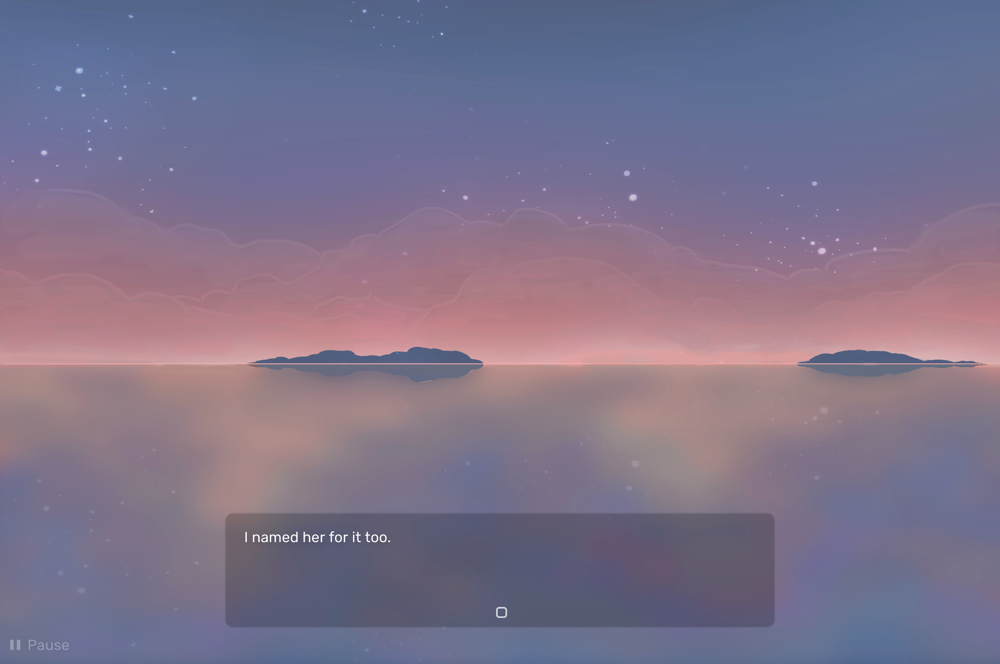
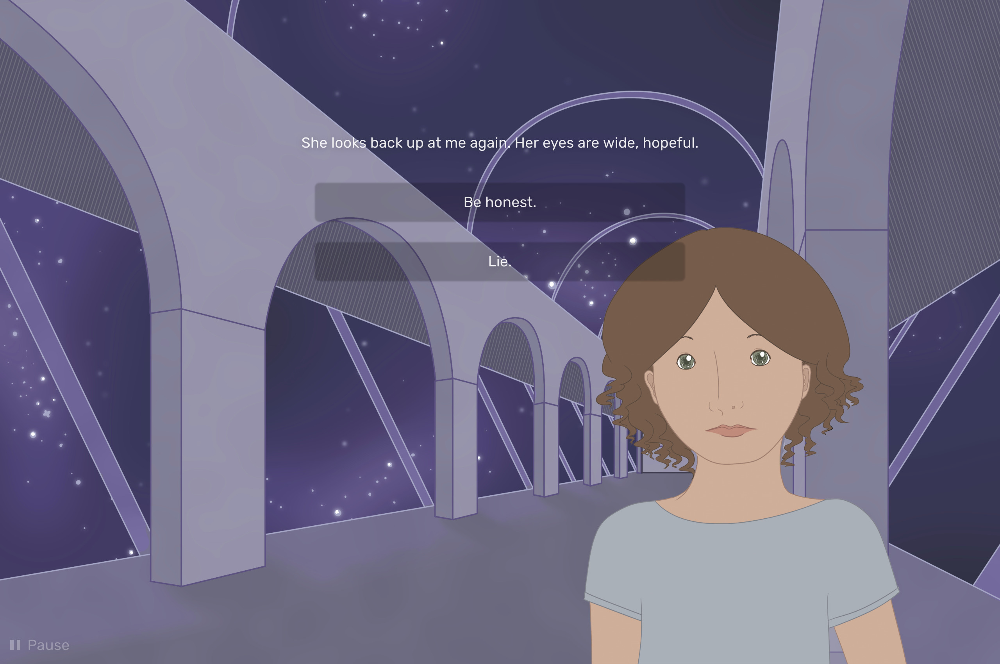
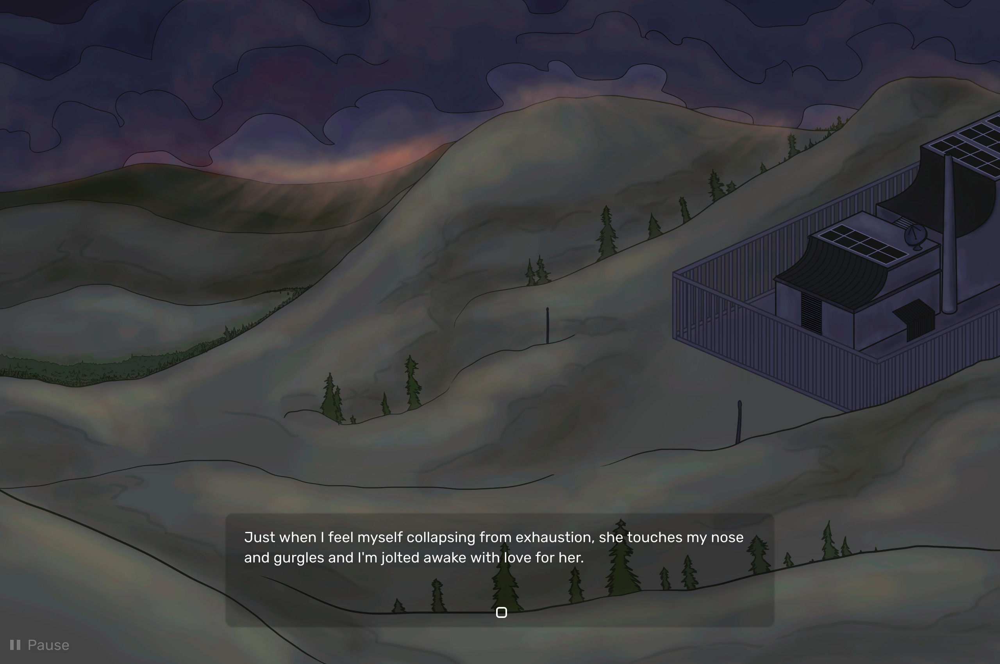
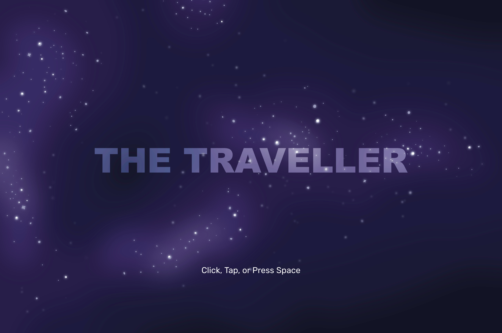
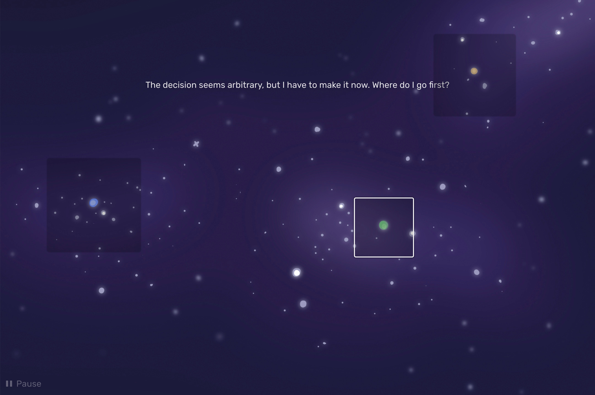
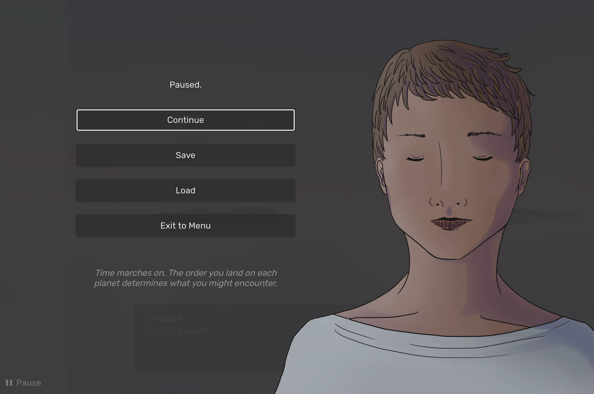

# The Traveller

*The Traveller* began as a class project by [Kaelan Doyle-Myerscough](https://kaelandm.wordpress.com/). At the end of the school year, Kaelan reached out to me and Toronto-based musician [Paul Geldart](https://astrolope.bandcamp.com/) to expand *The Traveller* into a fully-fledged visual novel.

[Play in Browser](http://traveller-game.com/)

We worked remotely over the summer. Kaelan reworked the narrative script and drew background and character art. Paul composed a multi-layered musical soundtrack for each in-game world. I worked on code, graphic and sound design for the UI, and miscellaneous tasks like setting up a custom web domain.

As a programmer working with both an artist/writer and a musician, I worked hard to go beyond just "adding interaction" to the visual and auditory experience; I drew on both my graphic design and music composition skills to further the creative visions of both Kaelan and Paul through the unique medium of code. As part of developing the asynchronous animation system, I designed text boxes atop Kaelan's beautiful backdrops, keeping in mind composition, readability, interaction, and cohesive visual style. In addition to programming the dynamic music system, which needed to mix different layers of Paul's atmospheric music in real time, I took care to design the "press start" sound to match harmonically with the main menu music.

*Click, Tap, or Press Space*: I opted to write *The Traveller* from the ground up as a modern web-first game. Gone are the days of lengthy downloads, installers, and loading screens -- launch *The Traveller* and begin playing *immediately*. All the visuals and sound are compressed, streamed, and preloaded in the background while you play. You can even play on your phone/tablet, or with a gamepad.

However, Kaelan had already written thousands of lines of dialogue in [Ren'Py](https://www.renpy.org/), a Python-based visual novel framework. To make this work on the web, I wrote a lightweight Ren'Py interpreter in JavaScript (for the non-programmers out there: I wrote some code to read and run a different kind of code---not an easy task). One perk of this was the flexibility to add custom language features for a more integrated creative workflow, allowing Kaelan to specify which of Paul's musical layers to load and when to switch between them, directly in the game's script.

The finished game was released in the[Interactive Fiction Competition](https://ifcomp.org/comp/2017) in October 2017, consisting of:

- 52,333 words of dialogue (by Kaelan) -- *around the size of a paper novel!*
- 121 digitally hand-drawn characters and backdrops (by Kaelan)
- 1 hour and 10 minutes of music, available on [Bandcamp](https://astrolope.bandcamp.com/album/the-traveller-ost) (by Paul)
- 2,612 lines of code (by myself)

---

In Collaboration With: [Kaelan Doyle-Myerscough](https://kaelandm.wordpress.com/), [Paul Geldart](https://astrolope.bandcamp.com/)

Learning Focus: Working with Creative Teams, Project Management, Writing Interpreters, Sound Design, Interaction Design, Writing Game Engines, Asset Streaming

Media: Visual Novel, Interactive Fiction, Website

Software: JavaScript, [ffmpeg](https://www.ffmpeg.org/), [Ren'Py](https://www.renpy.org/), [Bitwig Studio](https://www.bitwig.com/)

Release Date: Oct 2017

